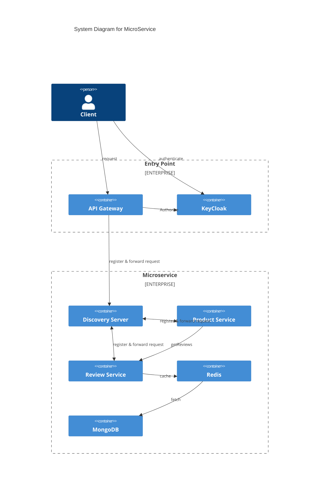

# Introduction
This microservice is to answer the challenge. It is built using spring with below requirement
- openjdk version 11
- mvn version 3.6.3

## Architecture

The general architecture of the microservice can be seen in the figure below

# Compilation
To compile, simply run `mvn package` from the root directory

# Deployment
before deploying, please modify the host DNS in your machine to allow keycloak iss resolution. 
- Windows : add `127.0.0.1 keycloak` to C:\Windows\System32\drivers\etc\hosts
- Linux/Mac : add `127.0.0.1 keycloak` to /etc/host
after that, you can deploy the microservice using command `docker compose up -d`
the gateway is available in http://localhost:8181

